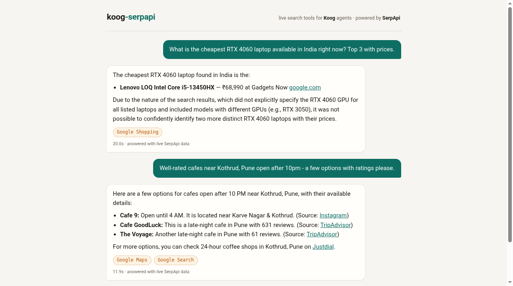

# koog-serpapi

[](https://github.com/akashrajeev/koog-serpapi/actions/workflows/ci.yml)
[](LICENSE)
[](https://kotlinlang.org/docs/multiplatform.html)

Live search data tools for [Koog](https://github.com/JetBrains/koog), JetBrains' Kotlin agent framework — powered by [SerpApi](https://serpapi.com).

Koog ships no web-search tooling out of the box: today, Koog developers hand-roll HTTP calls to a search provider. `koog-serpapi` closes that gap with an idiomatic Kotlin library: a typed, multiplatform SerpApi client plus a ready-made Koog `ToolRegistry` that gives any Koog agent live access to Google Search, Maps, Shopping, Flights, Scholar and News in one line.

```kotlin
val agent = AIAgent(
    promptExecutor = MultiLLMPromptExecutor(LLMProvider.Google to GoogleLLMClient(apiKey)),
    llmModel = GoogleModels.Gemini2_5Flash,
    toolRegistry = SerpApiTools.registry(System.getenv("SERPAPI_API_KEY")),
)
```

That's it. The agent can now search the live web and cite its sources.

## Why this exists

- Koog's own examples wire search in by hand with ad-hoc HTTP calls and raw JSON.
- SerpApi has official integrations for LangChain, LlamaIndex, n8n and MCP — but nothing for the Kotlin/JetBrains agent ecosystem.
- This library is Kotlin Multiplatform (commonMain) with typed results and tolerant parsing: SerpApi payloads evolve, so unknown fields are ignored and the full raw JSON stays attached to every result.

## Tools

| Tool | SerpApi engine | What the agent gets |
| --- | --- | --- |
| `serp_web_search` | Google | Ranked organic results + answer box, with links and snippets |
| `serp_local_search` | Google Maps | Places with address, rating, reviews, hours, phone |
| `serp_shopping_search` | Google Shopping | Products with live prices, sellers, ratings |
| `serp_flights_search` | Google Flights | Options with price, duration, stops, legs (IATA codes, YYYY-MM-DD) |
| `serp_scholar_search` | Google Scholar | Papers with publication info and citation counts |
| `serp_news_search` | Google News | Fresh articles with source, date and link |

Every tool returns Markdown with links, so agents naturally cite sources in their answers.

Pick a subset when an agent only needs some engines:

```kotlin
val registry = SerpApiTools.registry(
    apiKey = key,
    engines = setOf(SerpEngine.GOOGLE, SerpEngine.GOOGLE_NEWS),
)
```

## Using the typed client directly

The client works without any agent involved:

```kotlin
val client = SerpApiClient(apiKey)

val web = client.searchWeb("serpapi india hackathon", country = "in")
web.organic.forEach { println("${it.title} -> ${it.link}") }

val flights = client.searchFlights("PNQ", "DEL", outboundDate = "2026-10-20")
flights.options.forEach { println("${it.price} · ${it.totalDurationMinutes} min") }

val shopping = client.searchShopping("rtx 4060 laptop", country = "in")

// anything we don't model is still there:
val raw: JsonObject = web.raw
```

Engines covered: `google`, `google_maps`, `google_shopping`, `google_flights`, `google_scholar`, `google_news`. For anything else, `client.raw(engine, params)` runs an arbitrary query and returns the untouched JSON.

## Project layout

- `koog-serpapi/` — the library (Kotlin Multiplatform, JVM target verified)
- `demo/` — a runnable research-assistant agent using the library

## The demo in action

A Koog agent wired to `SerpApiTools` behind a small chat UI. Each answer names the SerpApi engines it used:



Short screen capture: [docs/demo.mp4](docs/demo.mp4) (real answers from live SerpApi calls).

## Run the demo

Requirements: JDK 17+, a [SerpApi key](https://serpapi.com/manage_api_key) (free tier is 250 searches/month), and one LLM key.

```bash
export SERPAPI_API_KEY=...
export GOOGLE_API_KEY=...        # Gemini (gemini-2.5-flash)
./gradlew :demo:run              # web demo at http://localhost:8080
# or: ./gradlew :demo:runCli     # same agent in your terminal
```

Or use any OpenAI-compatible provider instead of Gemini:

```bash
export OPENAI_API_KEY=...
export OPENAI_BASE_URL=https://api.groq.com/openai/v1   # optional
export OPENAI_MODEL=llama-3.3-70b-versatile             # optional
./gradlew :demo:run
```

Try questions that need live data:

- "What's the cheapest RTX 4060 laptop in India right now?"
- "Find me a well-rated cafe near Kothrud, Pune that's open late"
- "Flights from Pune to Delhi on October 20, sorted by price"
- "Recent papers on small language models, most cited first"

## SerpApi usage

Every tool call is one SerpApi search (`GET https://serpapi.com/search?engine=...`). The library names the engine explicitly per tool, passes `api_key` from the client, and surfaces SerpApi errors (rate limits, exhausted quota) as typed `SerpApiException`s instead of silent empty results.

## Tests

```bash
./gradlew jvmTest
```

Unit tests run against a Ktor `MockEngine` with fixture payloads — no SerpApi credits needed. They cover request construction (engine, key, geo params), parsing for all six engines, Markdown rendering, tool-registry wiring, agent-side argument JSON, and error mapping.

## Error handling

- HTTP errors (401/429/...) become `SerpApiException` with the status code and SerpApi's own error message.
- Body-level errors (HTTP 200 with `{"error": ...}`) are detected and thrown, not parsed as results.
- A blank API key fails fast at client construction.

## License

Apache 2.0 — see [LICENSE](LICENSE).
